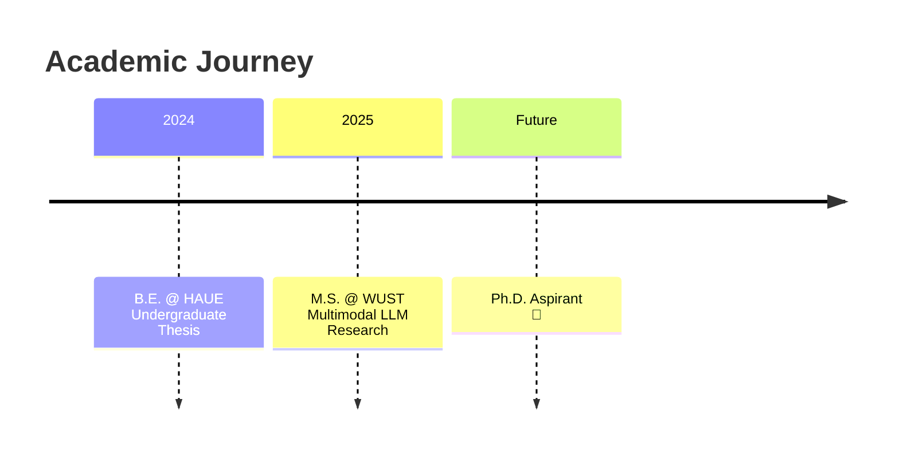

<div align="center">

[](https://git.io/typing-svg)

</div>

<div align="center">


</div>

<br/>

> *"The best way to predict the future is to invent it."* — Alan Kay

---

## 📖 About Me

<table>
<tr>
<td width="65%">

I am a graduate student at **Wuhan University of Science and Technology (WUST)** under the supervision of **Prof. Chen Li**. My research focuses on pushing the boundaries of multimodal intelligence — building systems that can see, read, and reason across visual and textual modalities.

- 🔬 **Research Focus:** Multimodal Large Language Models, Vision-Language Alignment, Deep Learning
- 📚 **Reading Groups:** Regular paper discussions on LLM architectures, multimodal fusion, and representation learning
- 🧪 **Daily Work:** Literature review, model implementation, ablation experiments, and academic writing
- 🎯 **Current Goal:** Bridging the modality gap between vision encoders and language decoders

</td>
<td width="35%" align="center">

```
  ⚡ Research Pipeline
┌─────────────────────┐
│  📄 Paper Survey    │
│        ↓            │
│  💡 Idea Formulation│
│        ↓            │
│  🧪 Experiment      │
│        ↓            │
│  📝 Manuscript      │
│        ↓            │
│  🚀 Submit / Publish│
└─────────────────────┘
```

</td>
</tr>
</table>

---

## 🧠 Research Interests

<div align="center">

| **Core Area** | **Keywords** |
|:--:|:--|
| 🖼️ **Multimodal Learning** | Vision-Language Models, Cross-modal Alignment, Multimodal Fusion |
| 🧠 **Large Language Models** | Instruction Tuning, RLHF, Chain-of-Thought, In-Context Learning |
| 👁️ **Computer Vision** | Object Detection, Image Understanding, Video Analysis |
| 🔗 **Representation Learning** | Contrastive Learning, Self-Supervised Learning, Knowledge Distillation |

</div>

---

## 📝 Publications & Manuscripts

<div align="center">

| # | Title | Venue | Status |
|:--:|:---|:---|:---:|
| 1 | *Coming soon...* | — | 🔬 In Progress |

> *Stay tuned — exciting work is underway!*

</div>

---

## 🛠️ Technical Arsenal

<div align="center">

### Languages


### Deep Learning


### Tools & Infrastructure


</div>

---

## 📊 GitHub Analytics

<div align="center">


</div>

---

## 🎓 Academic Timeline

<div align="center">



</div>

<table align="center">
<tr>
<td align="center" width="33%">🎓 <b>B.E.</b><br/>Henan University of<br/>Engineering</td>
<td align="center" width="33%">🔬 <b>M.S. (in progress)</b><br/>Wuhan University of<br/>Science & Technology</td>
<td align="center" width="33%">🎯 <b>Next Goal</b><br/>Top-tier Publications<br/>& Ph.D. Application</td>
</tr>
</table>

---

## 📬 Contact & Links

<div align="center">

| Channel | Info |
|:---:|:---|
| 📧 **Email** | [670512474@qq.com](mailto:670512474@qq.com) |
| 🏫 **Supervisor** | Prof. Chen Li · WUST |
| 🔬 **Research** | Multimodal LLMs · Vision-Language · Deep Learning |

</div>

<br/>

<div align="center">
  
</div>

---

<div align="center">

*"道阻且长，行则将至；行而不辍，未来可期。"*

**— The journey is long, but persistence leads to the destination.**

</div>
